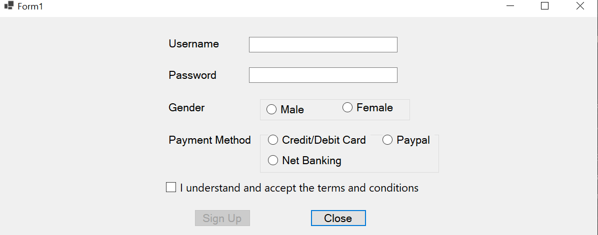

# GUI-Demo

### DESCRIPTION: 
Simple GUI-based [sign up] app to collect user information.

### CREDITS:
Based on a video from 
> https://www.simplilearn.com/tutorials/c-sharp-tutorial/c-sharp-gui#:~:text=CTMEEnroll%20Now-,What%20Is%20a%20C%23%20GUI%3F,Xerox%20Palo%20Alto%20research%20lab.

### ELEMENTS USED: 
Labels, textboxes, radio buttons, checkbox, buttons, groupboxes.

### LOGIC USED:
- **UseSystemPasswordChar** was set to true to allow the entry of password textbox to appear as the default password character. 
It could have also be set to a custom character via the **PasswordChar** property.

- a **GroupBox** was created and used to allow for specific control of the radiobuttons in a certain region for one label.
So the male/female radio buttons were placed into one GroupBox and the others into another for the 'Payment Method' label.

- ```button2.Enabled = checkBox1.Checked;```
This was used to control the state of the button 'Sign Up' based on the selection of the checkbox 'I understand and accept the terms and conditions'.<br>
In the screenshot, one can see the 'Sign up' button grayed out because the checkbox has not been selected.

- Finally,

```csharp
private void button1_Click(object sender, EventArgs e)
{
    DialogResult dr = MessageBox.Show("Would you like to close this window?", "Confirm", MessageBoxButtons.YesNo, MessageBoxIcon.Question);

    if (dr == DialogResult.Yes)
    {
        this.Close();
    }
} 
```

  This block of code shows the logic behind the way in which the 'Close' button (button_1) works:

  1. A function **button1_Click()** is created with two parameters: sender and e.
  ``
  2. The next line creates a **MessageBox** dialog box with a question icon and two buttons labeled "Yes" and "No".<br>
  Thus,  If the user clicks "Yes", the DialogResult value will be DialogResult.Yes. If the user clicks "No", the DialogResult value will be DialogResult.No.<br>
  the DialogResult value is stored in a variable named 'dr'.
  
  3. This 'dr' is then used in the if statement to determine whether to close the window.<br>
  Should the value be DialogResult.Yes, the window is closed by calling the Close() method of the current form (this.Close()).<br>
  Otherwise, the window remains.

### PROJECT STATUS:

The app works fine. In the future however, I (the programmer) would like to add more features to make it more useful.<br>
This could be like allowing the user to see all their created accounts, CRUD operations, and more!
  
### SCREENSHOT: 




Thank you for reading!
